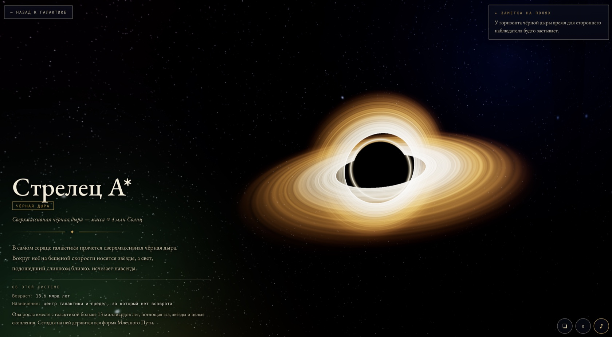
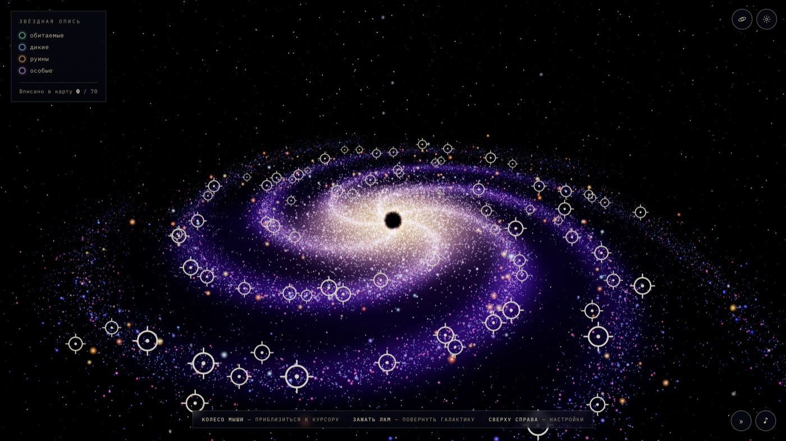
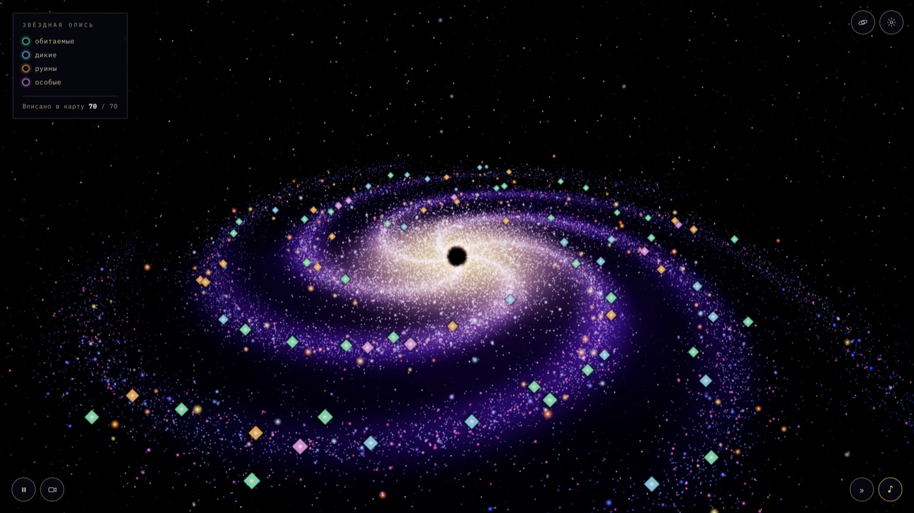
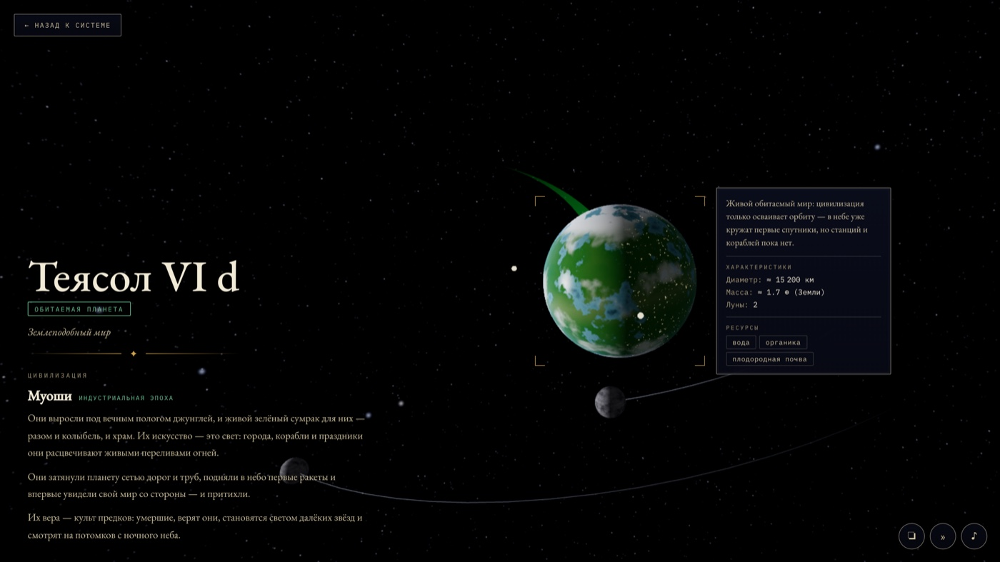
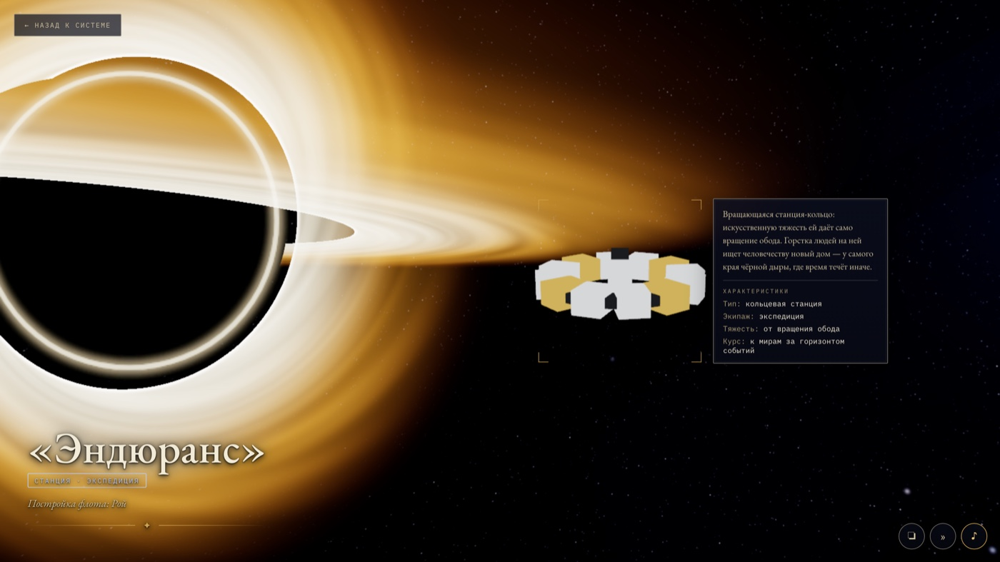

<div align="center">

<h1>🌌 Galaxy Explorer</h1>

<p><em>A spiral galaxy you can fall into — spin the star disk, dive into any sun,<br>and explore the worlds and civilisations generated around it.</em></p>

<p>
  <a href="https://galaxy-lyart-one.vercel.app"></a>
  
  
  
  <a href="https://galaxy-lyart-one.vercel.app"></a>
</p>

<sub>Runs in your browser · no build step · no dependencies · tuned for weak PCs</sub>

</div>

<!--
  ▶ DEMO VIDEO — real inline player (GitHub user-attachments, 60 fps).
  The clip is hosted on GitHub's asset store (uploaded via an issue drag-drop), so the
  bare URL below renders a native HTML5 player. To refresh it: re-encode a ≤10 MB clip
  to media/demo_hero.mp4, drag it into a new issue, and swap the URL below.
-->

https://github.com/user-attachments/assets/17c410d2-0553-4579-9012-27650fd0f966

<div align="center">
  <sub>▶ <b><a href="https://galaxy-lyart-one.vercel.app">Open the live galaxy</a></b> — it's interactive; the clip is just a taste.</sub>
</div>

---

## What it is

An interactive procedural spiral galaxy in the browser, in the spirit of the **Spore**
intro: a turning star disk, a glowing core, a gas nebula, and hundreds of coloured
"suns". Some of them are real **explorable systems** — hover to read a name and status,
click to warp smoothly inside, down to the star, its orbiting planets, and their story.

The whole universe is **procedurally generated from a seed**: the same seed → the same
galaxy, down to the last planet. The core engineering goal is to **run on weak PCs** — the
entire star disk is drawn in a single draw call, and rotation, twinkle, and star size are
computed on the GPU. Each frame the CPU updates exactly one number; it never iterates over
tens of thousands of stars.

<div align="center">
  <a href="https://galaxy-lyart-one.vercel.app"></a>
  <br>
  <sub><b>Sagittarius A*</b> — dive into the supermassive black hole at the galactic core: an accretion disk with Doppler boosting and a photon ring, wrapped in the brass cartographer HUD.</sub>
</div>

## Screenshots

<table>
  <tr>
    <td align="center" width="50%">
      <br>
      <sub><b>Uncharted</b> · every explorable system is a hollow survey ring</sub>
    </td>
    <td align="center" width="50%">
      <br>
      <sub><b>Charted</b> · visited systems become filled, status-coloured discs</sub>
    </td>
  </tr>
  <tr>
    <td align="center" width="50%">
      <br>
      <sub><b>A living world</b> · biomes, civilisation stage, and its own generated lore</sub>
    </td>
    <td align="center" width="50%">
      <br>
      <sub><b>Endurance</b> · the ring station orbiting a Gargantua-style black hole</sub>
    </td>
  </tr>
</table>

## Highlights

- 🌀 **One turning galaxy** — a procedural spiral disk, glowing bulge, and gas nebula, drawn in a single GPU draw call.
- 🪐 **Hundreds of explorable systems** — click a marker to warp inside: a star of its class, 2–7 planets on Keplerian orbits, moons, rings, and lore.
- 🧬 **Worlds with a story** — biomes, day/night cities, fleets, ruins, and a generated civilisation on each inhabited planet.
- 🎲 **Deterministic from a seed** — the same seed rebuilds the same galaxy, down to the last planet.
- 🛰️ **Hidden scenes** — Sagittarius A\*, Interstellar's Gargantua + Endurance, our Solar System, a Death Star, and more.
- 📔 **A codex of finds** — every world, race, ruin, ship and phenomenon you discover joins a permanent collection with honest "N of M" counters and a 3D showcase viewer; it survives seed changes.
- 🧭 **A first-flight tour** — a short skippable tutorial walks a new player through the Solar System: rotate, zoom, fly home, meet Earth, find it in the codex. Advances on your own actions, shows once.
- ⚡ **Runs on weak PCs** — no build step, no dependencies, no internet; rotation/twinkle/size live on the GPU.

---

## Run locally

ES modules require HTTP (not `file://`). Serve the project folder with any static server:

```bash
cd galaxy
python3 -m http.server 8000
# then open http://localhost:8000
```

The repo also ships `.nocache_server.py` — the same static server but with caching disabled,
handy while iterating (so a hard refresh is never needed):

```bash
python3 .nocache_server.py   # http://localhost:8124
```

> Three.js and lil-gui are vendored locally in `vendor/` — **no internet needed, no build step.**

System markers on the map are colour-coded: **green** — inhabited, **blue** — wild, **amber**
— ruins, **magenta** — special. Two icon shapes encode discovery: an **uncharted** system is a
fine hollow "survey ring"; once **charted** (visited) it becomes a filled status-colour disc (a
"catalogued star"). Everything else — controls, what lives inside a system, how and how often the
world is generated, the easter eggs, and the technical write-up — is tucked into the collapsible
sections below.

<details>
<summary><b>Controls &amp; the settings panel</b></summary>

<br>

### Controls

| Action | What it does |
| --- | --- |
| **Mouse wheel / pinch** | zoom toward the cursor and back out |
| **Hold LMB / drag** | orbit the camera around the centre |
| **Arrow keys / WASD** | orbit the camera (keyboard) |
| **Q / E** (or **+ / −**) | zoom in / out |
| **R** | start / stop the map rotation |
| **C** | toggle the cinematic auto-tour |
| **M** | toggle ambient music |
| **Hover a marker** | a hint table: star · planets · epoch · people + a teaser |
| **Click a marker** | warp into the system: star, planets, lore |
| **Esc** | one step back: codex viewer → codex → focused planet → system overview → galaxy |
| **Space** | drop a focused planet back to the system overview |
| **"?" button (top-right)** | open the controls cheat-sheet |
| **Settings gear (top-right)** | open / close the generator panel |
| **Codex tab (left edge)** | your permanent collection of discoveries — worlds, races, ships and stations (by faction), ruins and special finds — with progress and a 3D viewer |
| **Play/pause &amp; camera buttons (bottom-left)** | map rotation toggle &amp; cinematic tour |
| **View-mode button (bottom-right)** | system display mode (see below) |
| **Sound buttons (bottom-right)** | toggle ambient + next track (music is on by default) |

> **The universe freezes.** While you don't touch the mouse, the galaxy slowly auto-rotates.
> The moment you grab the camera (zoom / orbit) the **whole universe freezes** (not just the
> camera): stars, suns, the gas nebula, and the system markers all stop. Auto-rotation returns
> after **30 seconds** of idle. Star twinkle keeps running so the scene never looks dead.

> **Markers don't pulse.** Every marker is steady — only a very subtle, slow "breath" draws the
> eye. Hovering a marker is the strong signal: it eases up in size and tints toward brass.

**View mode** (button bottom-right, only inside a system) cycles through:

1. **labels** — clickable tags for planets, the flagship, and stations;
2. **clean scene** — no labels, objects only;
3. **cinematic** — hides the panel and centres the object in frame.

### Settings panel (lil-gui)

- **Palette** — 5 colour schemes (Spore, Ember, Emerald, Ice, Rose).
- **Quality** — `Low` (weak PC) / `Medium` / `High`: scales star count, anti-aliasing, and the
  pixel-ratio cap (values live in `config.js`).
- **Seed** + random roll — deterministic generation: one seed → the same galaxy.
- **Shape** — star count, arms, spin, arm width, scatter, core size and density, disk thickness.
  *(these change geometry — a rebuild fires when you release the slider)*
- **Suns** — count and size of the coloured suns.
- **Motion** — rotation speed, differential rotation, twinkle, camera auto-rotation.
- **Light & nebula** — tonemap exposure, star size, gas nebula and its density.
- **Systems** — share of explorable systems, markers on/off, "random system" button.

</details>

<details>
<summary><b>Inside a system: stars, planets, civilisations</b></summary>

<br>

Clicking a marker **dollies the camera in** to the system overview (no hard black cut). Inside is
a procedural star of its class (granules, spots, a coronal halo of rays) and **2–7 planets on
Keplerian orbits** (outer ones slower, ω ∝ a⁻¹·⁵).

### Planets

A shader paints the surface by planet archetype:

- **terran** — biomes (ocean · jungle · ice · desert · city-world), continents/oceans/clouds, a
  specular glint on water, a day/night terminator, an atmospheric rim;
- **gas giant** — banded zones and belts, a storm, **rings** with a Cassini gap, planet shadow,
  and transparency;
- **lava** (glowing veins), **ice**, **rocky**, **desert**;
- some planets carry small **moons** (realistically tiny and slow).

Each planet has a card: diameter (km), mass (Earth masses), resources, moon count, status
(homeworld / colony / ruins / lifeless) and a description.

### Stars

Classes **O / B / A / F / G / K / M**, weighted. Hot O/B stars are short-lived and **never**
inhabited; inhabited systems always have a long-lived star (A–M). Mass is in solar masses. Some
systems are **binaries** (a close pair) — planets then orbit the barycentre.

### Civilisations

Inhabited worlds sit at one of three stages, visible right on the planet:

1. **Tribal** — a dark night side;
2. **Industrial** — city lights + satellites in orbit;
3. **Spacefaring** — bright megacities, an orbital ring station, **colonies** on neighbouring
   planets, and **ship-lights** shuttling between worlds.

A homeworld's description includes a dedicated **race** block (who they are, their stage, what
they believe, what they strive for). Extinct civilisations carry the story of their catastrophe.

### Engagement

- on hover — a brief info table + a "click to explore →" teaser (the full story is one click away);
- an **"Explored N / M"** counter; uncharted markers breathe subtly to invite a visit;
- each system panel shows an **astrophysics fact**;
- each planet has a diegetic, clickable label right in the scene.

</details>

<details>
<summary><b>Events &amp; frequencies — how the world is generated</b></summary>

<br>

The world is **deterministic**: everything you see rolls out of the seed when a system is built —
there are no random "timer" events. So "events" come in two kinds:

- **A. Generation outcomes** — `0..1` rolls from the seed, decided once. Their probabilities are below.
- **B. Live animations** — what moves continuously each frame (orbits, ships, comets, rotation).

All probabilities live in one place — `src/systems/genParams.js` (the `GEN` object); the share of
explorable systems and the quality presets are in `src/config.js`. Tune the balance there.

> Before the first roll the generator does **two throwaway `rng.next()` calls**: the first
> mulberry32 roll on a string seed is biased, and without a "warm-up" the outcome mix skewed.

### A. Generation outcomes and their frequency

**System status** is no longer an independent roll — it's a consequence ("life as a
consequence", see `GENERATION.md` for the full causal chain): the star is rolled first,
its class defines climate bands across the orbits, bands restrict which planet archetypes
can exist where, and a temperate-band terran/ocean world is a *life candidate*. A system
with no candidates is wild, full stop (O/B-class stars have no temperate band at all);
otherwise a calibrated chance decides whether life happened and whether it already ended:

| Outcome | How it happens | Share (calibrated) |
| --- | --- | --- |
| inhabited | candidates exist, life happened, still alive | ~49% |
| wild | no candidates (~20%) or life never sparked (~5%) | ~25% |
| ruins (dead) | life happened and already ended | ~26% |

**Civilisation stage** (inhabited only, roll `0..1`):

| Stage | Condition | What you see |
| --- | --- | --- |
| Tribal | `< 0.38` | dark night |
| Industrial | `0.38…0.72` | lights + satellites |
| Spacefaring | `≥ 0.72` | megacities, ring station, ships, colonies — settlements on liveable worlds, pressurised dome bases on hostile ones, the odd terraformed rock |

**Nature of ruins** (dead worlds only, roll `0..1`):

| Type | Condition | Detail |
| --- | --- | --- |
| Robots | `< 0.25` | extinct, machines keep a depot + 2–4 freighters, cold lights still on |
| Crater | `0.25…0.50` | a catastrophe scar (a distinct colour on the surface) |
| Shattered | `0.50…0.85` | the planet is torn into a debris field |
| Grey ruins | `≥ 0.85` | simply an emptied world |

For destroyed worlds, **refugees** flee to a colony on a neighbouring planet with chance **0.70**
(otherwise they live on a **flagship** — a fleet of 2–4 ships).

**System structure &amp; population:**

| Parameter | Value |
| --- | --- |
| Binary star | chance **0.28** |
| Planets per system | **2–7** |
| Comets | chance **0.70**, when present — **1–3** |
| Lone scout flagship in a wild system | chance **0.33** |
| Share of suns that become explorable systems | **0.40** (`config.realSystemFraction`) |
| Planet rings | gas ~55%, ice ~12% |
| Moons | gas ≤ 3, terran/ocean ≤ 2, others ≤ 1 |

### B. Live events (animations)

| Event | Frequency / pace |
| --- | --- |
| Galaxy rotation | continuous while idle; **freezes on interaction**, resumes after **30 s** |
| Planet orbits | Keplerian, ω ∝ a⁻¹·⁵ (outer ones slower) |
| Spacefaring ships | continuously commute between planets (home ↔ colonies) |
| Scout flagship / refugee fleet | roam the system looking for a world to colonise |
| Robot freighters | haul cargo between depots of a dead world |
| Comets | drift slowly along a random chord (they never fall into the star) |
| Star twinkle &amp; sun pulse | always, even when rotation is frozen |

**Factions.** On inhabited systems, factions are assigned **round-robin**, so all 6 ship races /
styles are guaranteed to appear. The full fleet + station "bestiary" is the codex (grouped by faction).

</details>

<details>
<summary><b>Special systems (easter eggs)</b></summary>

<br>

Marked in a **separate colour — magenta "special"**, their planets carry a special tag in the
panel, and they do **not** count toward the "Explored" counter. These are hand-crafted scenes
pinned to the arms:

- **Sagittarius A\*** — the supermassive black hole at the galactic centre: a black horizon, an
  accretion disk (temperature gradient + Keplerian shear + Doppler boosting), a photon ring.
- **Gargantua ("Interstellar")** — a disk that "wraps" above and below the hole via lensing, with
  the rotating ring station **Endurance** in orbit around it.
- **Our Solar System** — 8 planets, 1:1.
- **"Black Quarantine"** (Dead Space-flavoured) — an obelisk world with the planet-cracker ship
  **Ishimura** hanging above it.
- **4 film worlds** — Twin-Sun, Spice Reach, Storm Moon, Ice Wilds, each with a real film/game ref.
- **Battle station "Hand"** (Death Star) — an armoured sphere with an equatorial trench, latitude
  furrows, and a concave superlaser dish with a green emitter; it **orbits** the star with an escort
  of 5 imperial ships, parked in the **"Alderaan Sector"** next to a shattered planet — a recreated scene.

</details>

<details>
<summary><b>Technical notes &amp; performance</b></summary>

<br>

### Stack

- **Three.js 0.160**, pure ES modules + an import map, everything vendored in `vendor/` — **no
  build**, no `npm install`, no internet.
- Rendering — `WebGLRenderer` + an HDR pipeline (`EffectComposer` / `OutputPass`) with ACES tonemapping.
- `OrbitControls` for the camera, `lil-gui` for the panel.

### Why it runs on weak PCs

- **One draw call** for the whole star disk (`BufferGeometry` + `THREE.Points`).
- **Rotation, twinkle, and size on the GPU** in the vertex shader: the CPU updates one number per
  frame instead of iterating over stars.
- **Two rotation clocks.** `uRotTime` (the spin clock) only advances while idle and **freezes on
  interaction**; `uTime` (twinkle/pulse) always runs. The gas nebula also rides `uRotTime`, so it
  freezes with the stars and never detaches from the arms.
- **Rigid rotation** — the whole disk (and nebula) turns at one angular speed. The spiral is baked
  into the star positions, so the disk simply rotates and **never winds up** even after a long idle.
  *(Differential rotation looks great for the first minute but coils the arms into a tight spiral
  over an hour — that bug is closed by rigid rotation.)*
- **No textures** — star sprites are drawn procedurally in the fragment shader.
- **HDR + ACES instead of heavy bloom**: the core glows softly without an expensive multi-pass post effect.
- **Point size clamped** to the GPU hardware limit (`ALIASED_POINT_SIZE_RANGE`) — less overdraw, no driver cutoff on weak cards.
- **Pixel ratio capped** by the quality preset; **MSAA 4×** only on Medium / High.
- **Render paused** on a hidden tab.
- **Auto-downgrade**: on sustained low FPS, pixel ratio drops to 1.0 once.

Reference: Medium (38k stars) runs comfortably on integrated graphics; Low (16k) is for very weak machines.

### Sound

Ambient — three licensed tracks (`audio/tracks/`): **Kevin MacLeod (CC-BY)** and **yd (CC0)**.
Attribution is shown in the track caption and in `audio/CREDITS.txt`. Toggled with the sound
buttons in the bottom-right corner (music is on by default, starting on your first interaction).

UI sounds (`audio/sfx/`) — a small public-domain set: a relay click for buttons, a barely-there
synth tick on marker hover, a designed whoosh pair for the warp in/out (the quieter planet glide
reuses the warp-in), and a page turn / book close for the codex. The cinematic show stays silent.
The ♪ button is the one master switch for ALL audio (music + effects); the two volumes live in
the settings panel («Звук»), persisted per device. Credits in `audio/CREDITS.txt`.

</details>

<details>
<summary><b>Project structure</b></summary>

<br>

```
galaxy/
├── index.html              # canvas + import map + overlays
├── styles.css
├── favicon.svg             # brass cartographer survey-ring favicon
├── .nocache_server.py      # no-cache static server (port 8124)
├── vercel.json             # static-deploy headers (always revalidate)
├── media/                  # README demo video, poster, screenshot gallery
├── vendor/                 # vendored Three.js core/addons + lil-gui
├── audio/tracks/           # ambient (CC-BY / CC0) + CREDITS.txt
├── audio/sfx/              # UI one-shots (CC0, freesound.org) — click/hover/chart/warp/codex
└── src/
    ├── main.js             # renderer, camera, OrbitControls, loop, keyboard, adaptivity
    ├── config.js           # defaults + quality presets (star/sun counts)
    ├── assetLoader.js      # lazy texture fetches with a per-tag byte ledger
    ├── palettes.js         # colour schemes
    ├── rng.js              # seeded PRNG (mulberry32) for reproducibility
    ├── galaxy.js           # star-disk + bulge generation
    ├── suns.js             # the coloured "suns" layer
    ├── background.js       # far star field + gas nebula
    ├── nebulaClouds.js     # gas clouds in the deep background
    ├── postfx.js           # HDR pipeline + ACES tonemapping
    ├── gui.js              # the lil-gui panel
    ├── audio/ambient.js    # ambient player (tracks + switching)
    ├── audio/sfx.js        # UI-sound manager (lazy pool, volume/mute persisted)
    ├── audio/sfxEvents.js  # event → asset + relative-volume table
    ├── state/              # persistence: storage envelope, world overlay, party lifecycle
    ├── codex/              # the discovery codex: catalogs, log, panel, find rebuilder
    ├── onboarding/         # first-flight tour: declarative steps + the FSM coachmark
    ├── systems/            # explorable systems
    │   ├── genParams.js    # ALL generation probabilities / shares (GEN)
    │   ├── systemData.js   # build a system from a seed + the special systems
    │   ├── markers.js      # galaxy markers (survey ring / catalogued disc, hover, raycast)
    │   ├── focusConfig.js  # per-object-type camera framing distances
    │   ├── lore.js         # names, stories, races, resources, facts
    │   ├── planet.js       # planet: mesh + shader + rings + moons + trail
    │   ├── systemView.js   # system scene: star + planets + orbits, enter/exit, focus
    │   ├── blackHole.js    # black hole (horizon + accretion disk)
    │   ├── comet.js        # comets
    │   ├── debris.js       # debris field of destroyed planets
    │   ├── endurance.js    # the Endurance ring station
    │   ├── deathStar.js    # the Death Star (armoured sphere + superlaser dish)
    │   ├── ishimura.js     # the Ishimura planet-cracker
    │   ├── dragon.js       # a Crew Dragon en route to Mars (Solar System easter egg)
    │   ├── stations.js     # civilisation orbital stations
    │   ├── ships.js        # ship-lights + transfers
    │   └── ships/          # fleet factions, roles, ship styles
    ├── ui/
    │   ├── hud.js          # lore panel, hint table, legend, transition overlay
    │   ├── objectViewer.js # isolated-canvas 3D viewer (codex «Рассмотреть»)
    │   └── planetLabels.js # diegetic planet/station labels (real-size de-overlap)
    └── shaders/
        ├── starShader.js          # galaxy stars: rotation/twinkle/size (GPU)
        ├── sunShader.js           # pulsing suns
        ├── nebulaShader.js        # gas disk (fbm noise + arm echo)
        ├── planetShader.js        # per-type planet surfaces
        ├── starSurfaceShader.js   # system star: granules + limb darkening + corona
        └── blackHoleShader.js     # accretion disk + lensing
```

A detailed map of the generation rules (what, how much, where) is in `GENERATION.md`.

</details>

<details>
<summary><b>Dev console</b></summary>

<br>

The app is exposed as `window.galaxyApp` — you can tweak parameters from DevTools:

```js
galaxyApp.config.rotationSpeed = 0.12;
galaxyApp.applyLive();          // apply "live" parameters without a rebuild

galaxyApp.config.seed = 'orion';
galaxyApp.rebuild();            // full geometry rebuild for the new seed

galaxyApp.getPerfSnapshot();    // fps/draw-calls/triangles/etc. checked against PERF_BUDGETS
galaxyApp.debugJumpTo((e) => e.data.seed === 'death-star'); // warp straight into a system by predicate
```

</details>

<details>
<summary><b>Maintainer — refreshing the demo clip</b></summary>

<br>

The hero is a real, inline-playing video. GitHub renders a `<video>` player **only** for files on
its own asset store, so the clip is not committed — it's uploaded as a GitHub attachment:

1. Capture / re-encode a ≤10 MB H.264 clip to `media/demo_hero.mp4` (`-movflags +faststart`).
2. Open a [new issue](https://github.com/syakubson/procedural-galaxy/issues/new) and **drag the
   file into the comment box**; wait for the upload to finish.
3. Copy the generated `https://github.com/user-attachments/assets/<uuid>` URL (you can close the
   issue without submitting — the asset persists on GitHub's CDN).
4. In the README hero, replace the poster block with that URL on its own line, or:
   `<video src="…assets/<uuid>" controls width="860"></video>`.

</details>

---

## Deploy

Static site, no build step — deployable to any static host. It runs live on **Vercel**
(<https://galaxy-lyart-one.vercel.app>); `vercel.json` sets always-revalidate cache headers so a
redeploy is picked up immediately, and `.vercelignore` keeps dev-only files out of the bundle.

---

## Housekeeping

- Binaries over 10 MB don't get committed — they go on a CDN/Blob instead, with a procedural
  fallback mandatory for whatever loads them, so the scene still works if that fetch fails.
- `scripts/perf_bench.py` drives the app headless and checks draw calls / triangles per scene
  against the budgets in `src/config.js`, catching perf regressions before they ship.
